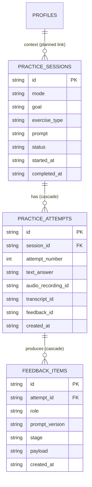

# Domain Model

The `src/domain` layer holds the pure business rules, types, and schemas for the
AI Communication & Interview Trainer. It has **no** dependencies on the database,
the AI provider, or Next.js — everything here is deterministic and unit-testable.
The application layer (`src/application`) orchestrates these rules; the
infrastructure layer persists and executes them.

Source files covered by this document:

| Concern | File |
| --- | --- |
| Practice entities & exercise types | `src/domain/practice/types.ts` |
| Staged coaching rules | `src/domain/practice/coaching-stage.ts` |
| Vietnamese feedback contract | `src/domain/practice/vietnamese-feedback.ts` |
| Feedback taxonomy & skill dimensions | `src/domain/feedback/taxonomy.ts` |
| Persistence mapping | `src/infrastructure/db/schema.ts` |

---

## Entities

### PracticeSession

A single practice engagement around one prompt. Defined as `PracticeSession` in
`src/domain/practice/types.ts` and persisted to the `practice_sessions` table.

| Domain field | Type | DB column | Notes |
| --- | --- | --- | --- |
| `id` | `string` | `id` (PK) | |
| `mode` | `PracticeMode` = `"vietnamese" \| "english"` | `mode` | English mode is **Planned** (later phase); only `"vietnamese"` is exercised today. |
| `goal` | `string` | `goal` | User-facing intent of the session. |
| `exerciseType` | `VietnameseExerciseType?` | `exercise_type` | Optional; see [Exercise types](#exercise-types). |
| `prompt` | `string` | `prompt` | The question/task the user responds to. |
| `questionId` | `string?` | `question_id` | Link to a curated question bank. **Planned.** |
| `status` | `SessionStatus` = `"active" \| "completed" \| "abandoned"` | `status` (default `active`) | User controls completion. |
| `startedAt` | `string` (ISO-8601) | `started_at` | |
| `completedAt` | `string \| null?` | `completed_at` | |

### PracticeAttempt

One submission within a session. Defined as `PracticeAttempt` in
`src/domain/practice/types.ts`, persisted to `practice_attempts`
(`ON DELETE CASCADE` from its session).

| Domain field | Type | DB column | Notes |
| --- | --- | --- | --- |
| `id` | `string` | `id` (PK) | |
| `sessionId` | `string` | `session_id` (FK → `practice_sessions.id`) | Cascade delete. |
| `attemptNumber` | `number` | `attempt_number` | 1-based. **Assigned by the application service, never by the AI.** |
| `textAnswer` | `string \| null?` | `text_answer` | Saved *before* the AI runs, so user work survives AI failure. |
| `audioRecordingId` | `string \| null?` | `audio_recording_id` | Audio stored as local files via `LocalAudioStorage`, not blobs. **Planned.** |
| `transcriptId` | `string \| null?` | `transcript_id` | **Planned.** |
| `feedbackId` | `string \| null?` | `feedback_id` | |
| `createdAt` | `string` (ISO-8601) | `created_at` | |

### FeedbackItem (persistence)

There is no domain interface for feedback rows; the validated feedback object
(e.g. `VietnameseCoachFeedback`) is serialized into the `feedback_items` table.

| DB column | Notes |
| --- | --- |
| `id` (PK) | |
| `attempt_id` (FK → `practice_attempts.id`) | Cascade delete. |
| `role` | AI role that produced it, e.g. `"vietnamese-coach"`. |
| `prompt_version` | e.g. `"vietnamese-coach@1.0"`. |
| `stage` | Coaching stage in effect when generated (`diagnose` / `guide` / `improve`). |
| `payload` | JSON of the **validated** feedback object. |
| `created_at` | |

### Relationship diagram



> `profiles` exists in the schema and carries user context (`currentRole`,
> `targetRole`, `targetMarkets`, `primarySkills`, `transcriptMode`, …), but there
> is no foreign key from `practice_sessions` to `profiles` yet — the link shown
> above is **Planned**.

---

## Staged coaching: CoachingStage & CoachingPolicy

This is the **critical business rule** of the product, encoded purely in
`src/domain/practice/coaching-stage.ts`. The application controls the workflow;
the AI only supplies intelligence. Each attempt is allowed to reveal only a
certain amount of help, *independent of what the model returns*.

```ts
type CoachingStage = "diagnose" | "guide" | "improve";

interface CoachingPolicy {
  stage: CoachingStage;
  canRevealImprovedVersion: boolean; // may a full rewrite be shown this attempt?
  canGiveDirection: boolean;         // may concrete structure/direction be given?
  label: string;                     // short UI label
}
```

`coachingPolicyForAttempt(attemptNumber)` maps the attempt number to a policy:

| Attempt | Stage | `canGiveDirection` | `canRevealImprovedVersion` | Label | Behavior |
| --- | --- | --- | --- | --- | --- |
| 1 | `diagnose` | `false` | `false` | Diagnose | Diagnosis + reflection questions. **No rewrite.** |
| 2 | `guide` | `true` | `false` | Guide | Direction / structure hints. **No rewrite.** |
| 3+ | `improve` | `true` | `true` | Improve | Improved/rewritten version **may** be revealed. |

### The guardrail

`enforceCoachingPolicy(feedback, policy)` is applied to every AI response:

```ts
if (!policy.canRevealImprovedVersion && feedback.improvedVersion) {
  return { ...feedback, improvedVersion: null };
}
```

This means that even if the model ignores its instructions and returns a full
rewrite on attempt 1 or 2, the domain layer strips `improvedVersion` before it is
ever persisted or shown. The acceptance criteria hold regardless of model
behavior.

### Who owns what

Ownership lives in `src/application/practice/vietnamese-coach-service.ts`
(Rule 3 — the application owns the workflow):

- **Attempt numbering** — `countAttempts(sessionId) + 1`, not the AI.
- **Stage selection** — `coachingPolicyForAttempt(attemptNumber)`.
- **Enforcement** — `enforceCoachingPolicy(raw, policy)` before saving.
- **Completion** — the user controls it via
  `completeVietnameseSession` / `abandonVietnameseSession`; the AI's
  `nextAction` is advisory only.
- **Durability** — the user's `textAnswer` is written *before* the AI call, so
  work is preserved on AI failure.

---

## Feedback taxonomy

Defined in `src/domain/feedback/taxonomy.ts`. Every issue the system raises maps
to a stable code so progress, memory, and analytics can aggregate consistently.

### Categories

`FEEDBACK_CATEGORIES` = `thinking`, `communication`, `english`, `pronunciation`,
`interview` (type `FeedbackCategory`).

### Codes by category

| Category | Constant | Codes |
| --- | --- | --- |
| thinking | `THINKING_CODES` | `unclear_idea`, `missing_point`, `weak_logic`, `poor_structure` |
| communication | `COMMUNICATION_CODES` | `too_long`, `repetitive`, `main_point_late`, `unclear`, `incomplete` |
| english | `ENGLISH_CODES` | `grammar`, `vocabulary`, `unnatural_phrase`, `fluency`, `filler` |
| pronunciation | `PRONUNCIATION_CODES` | `word_clarity`, `stress`, `rhythm`, `intelligibility` |
| interview | `INTERVIEW_CODES` | `too_generic`, `insufficient_depth`, `weak_tradeoff`, `weak_example`, `unsupported_claim`, `missing_metric` |

`ALL_FEEDBACK_CODES` is the union of all five arrays; `FeedbackCode` is its
element type.

> Vietnamese coaching (the currently implemented loop) uses only the `thinking`
> and `communication` codes. The `english`, `pronunciation`, and `interview`
> codes exist in the taxonomy for later phases (English speaking / interview
> modes) — treat their consumption as **Planned**.

### Skill dimensions

`SKILL_DIMENSIONS` (type `SkillDimension`) are the per-user progress axes that
feedback codes roll up into:

```
structure, clarity, conciseness, completeness, logic,
grammar, vocabulary, naturalness, fluency, filler_usage,
pronunciation, technical_depth, behavioral_depth
```

Aggregation of attempts into per-dimension progress is **Planned**; the
dimensions themselves are defined and stable.

---

## VietnameseCoachFeedback schema

The structured output contract for the Vietnamese Coach, defined with Zod in
`src/domain/practice/vietnamese-feedback.ts`. Every AI response is validated
against this — unvalidated output is never trusted or persisted.

A core rule (§19): Vietnamese coaching **separates thinking problems from
communication problems** and must not conflate language issues with thinking
issues. This is enforced structurally — an issue's `category` is restricted to
`thinking | communication`, and its `code` is restricted to the union of only
`THINKING_CODES` and `COMMUNICATION_CODES`.

### `vietnameseIssueSchema` → `VietnameseIssue`

| Field | Type | Notes |
| --- | --- | --- |
| `category` | `"thinking" \| "communication"` | The thinking/communication split. |
| `code` | `THINKING_CODES ∪ COMMUNICATION_CODES` | Must match the category's domain. |
| `title` | `string` (min 1) | Short label. |
| `detail` | `string` (min 1) | Explanation. |

### `vietnameseCoachFeedbackSchema` → `VietnameseCoachFeedback`

| Field | Type | Default | Notes |
| --- | --- | --- | --- |
| `summary` | `string` (min 1) | — | Overall assessment. |
| `strengths` | `string[]` | `[]` | |
| `issues` | `VietnameseIssue[]` | `[]` | The thinking/communication findings. |
| `reflectionQuestions` | `string[]` | `[]` | Core of attempt 1 (diagnose stage). |
| `suggestions` | `string[]` | `[]` | Direction / structure hints — allowed from attempt 2 (guide). |
| `improvedVersion` | `string \| null` | `null` | Full rewrite. Only permitted from attempt 3+; stripped earlier by `enforceCoachingPolicy`. |
| `nextAction` | `"retry" \| "satisfied_or_retry"` | `"retry"` | Advisory; the **user** controls completion. |

### How the schema maps onto the stages

| Field | diagnose (1) | guide (2) | improve (3+) |
| --- | --- | --- | --- |
| `summary`, `strengths`, `issues` | ✅ | ✅ | ✅ |
| `reflectionQuestions` | ✅ (primary) | ✅ | ✅ |
| `suggestions` | (empty) | ✅ | ✅ |
| `improvedVersion` | ❌ stripped | ❌ stripped | ✅ allowed |

---

## Exercise types

`VIETNAMESE_EXERCISE_TYPES` (type `VietnameseExerciseType`) in
`src/domain/practice/types.ts`, each with a UI label in `EXERCISE_LABELS`:

| Code | Label |
| --- | --- |
| `explain_problem` | Explain a problem |
| `tell_story` | Tell a story |
| `give_opinion` | Give an opinion |
| `explain_concept` | Explain a technical concept |
| `explain_experience` | Explain an experience |
| `interview_answer` | Interview answer |
| `casual_conversation` | Casual conversation |
| `rewrite_messy` | Rewrite a messy thought |

The exercise type is optional on a `PracticeSession` and is passed through to the
coach role to shape the prompt.
